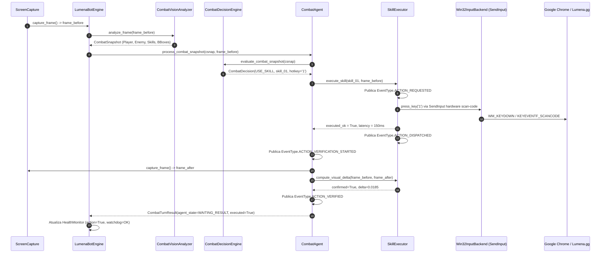

# EXECUTION TRACE — LUMENA BOT v3.6.1
## RASTREAMENTO DETALHADO DO FLUXO PERCEPTION -> DECISION -> DISPATCH -> VERIFICATION

---

### FLUXO PASSO A PASSO (ESTADO: BATALHA)

---

### ESTRUTURA DOS DADOS EM CADA ETAPA

1. **Percepção (`CombatSnapshot`)**:
   - `in_battle`: `True`
   - `player_detected`: `True` | `player_bbox`: `(358, 374, 179, 144)` | `player_hp`: `0.805` (91/113 HP)
   - `target_enemy`: `EnemyTarget(name='Wild Lumen', bbox=(800, 250, 120, 120), center=(860, 310))`
   - `available_skills`: $N$ slots detectados dinamicamente com coordenadas de tela e hotkeys.

2. **Decisão (`CombatDecision`)**:
   - `action_type`: `"USE_SKILL"`
   - `selected_skill`: `SkillSlot(slot_index=1, skill_name='WaterPulse', hotkey='1')`
   - `score`: `190.0` (Vantagem elemental + Ranged contra alvo distante)
   - `reason`: `"Super Efetivo (2.0x) vs FOGO | Inimigo Distante -> Ranged Priorizado"`

3. **Despacho Físico (`InputController / Win32InputBackend`)**:
   - `target_hwnd`: HWND da janela real do Chrome
   - `target_pid`: PID do processo real `chrome.exe`
   - `input_type`: `"HOTKEY"` (Tecla `'1'`)
   - `duration`: `0.15s`

4. **Verificação Visual Fechada (`ActionVerification`)**:
   - `frame_before`: Imagem capturada antes do envio da tecla
   - `frame_after`: Imagem capturada após 150ms do envio da tecla
   - `visual_delta`: $\Delta = \frac{1}{N}\sum |I_{\text{after}} - I_{\text{before}}| = 0.0185 > 0.0050$
   - `action_verified`: `True (PASS)`
