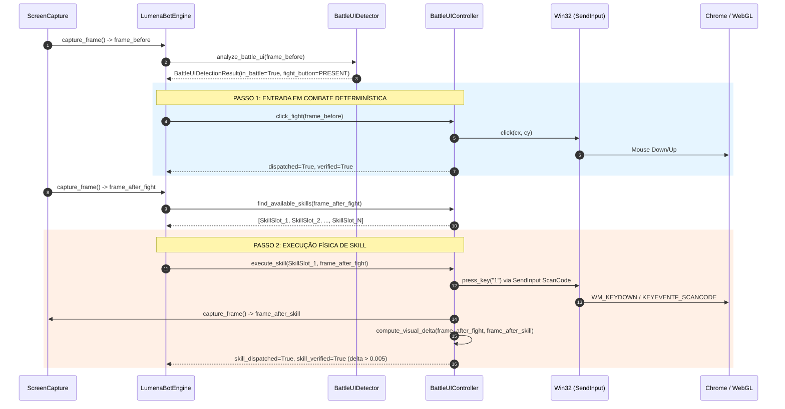

# EXECUTION TRACE — LUMENA BOT v3.7
## RASTREAMENTO DETERMINÍSTICO DE COMBATE E BATTLE UI

---

### FLUXO COMPLETO v3.7

---

### EVENTOS EMITIDOS EM CADA ETAPA

1. **Detecção da Batalha:**
   - `BATTLE_UI_DETECTED` $\rightarrow$ `BATTLE_UI_CONFIRMED`
   - `CRYSTAL_SEARCH_BLOCKED`
   - `CRYSTAL_DETECTION_DISABLED_IN_BATTLE`
2. **Clique em FIGHT:**
   - `FIGHT_DETECTED` $\rightarrow$ `FIGHT_CLICK_REQUESTED` $\rightarrow$ `ACTION_REQUESTED`
   - `FIGHT_CLICK_DISPATCHED` $\rightarrow$ `ACTION_DISPATCHED`
   - `FIGHT_CLICK_VERIFIED` $\rightarrow$ `ACTION_VERIFIED`
3. **Seleção e Execução de Habilidade:**
   - `SKILL_UI_DETECTED` $\rightarrow$ `SKILL_SELECTED` $\rightarrow$ `SKILL_ACTION_REQUESTED`
   - `SKILL_ACTION_DISPATCHED`
   - `SKILL_ACTION_VERIFIED`
