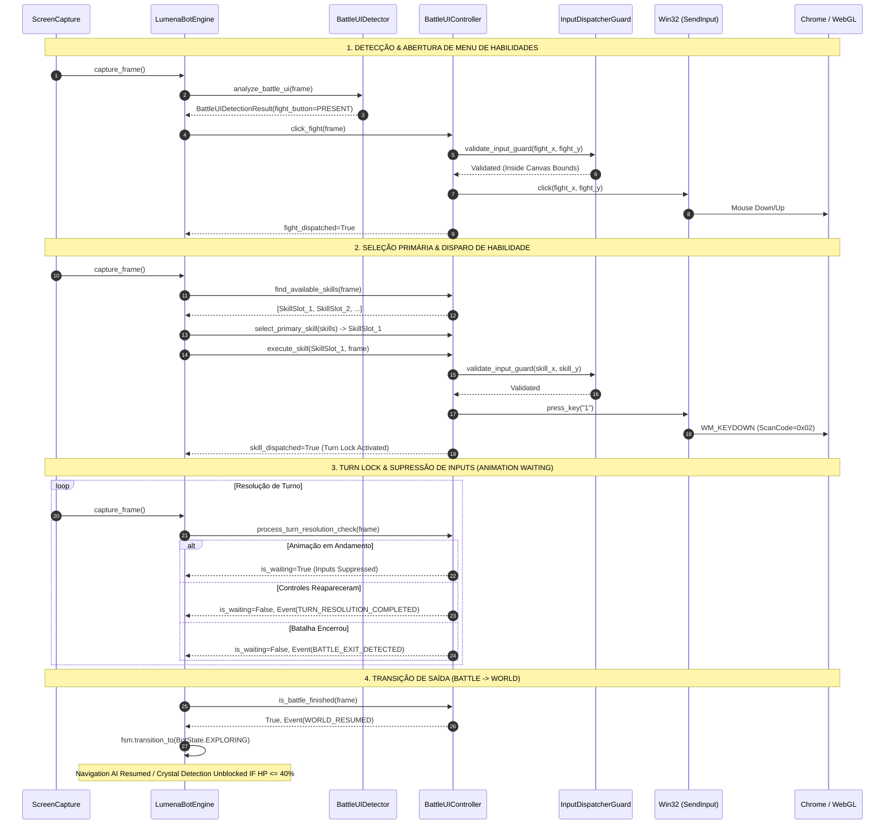

# EXECUTION TRACE — LUMENA BOT v3.8
## RASTREAMENTO DO CICLO COMPLETO DE COMBATE DETERMINÍSTICO

---

### DIAGRAMA DE SEQUÊNCIA v3.8

---

### TRACE DE EVENTOS GERADOS NO CICLO

1. `BATTLE_UI_DETECTED` $\rightarrow$ `BATTLE_UI_CONFIRMED` $\rightarrow$ `CRYSTAL_SEARCH_BLOCKED`
2. `FIGHT_DETECTED` $\rightarrow$ `FIGHT_CLICK_REQUESTED` $\rightarrow$ `FIGHT_CLICK_DISPATCHED` $\rightarrow$ `FIGHT_CLICK_VERIFIED`
3. `SKILL_UI_DETECTED` $\rightarrow$ `SKILL_SELECTED` $\rightarrow$ `SKILL_ACTION_REQUESTED` $\rightarrow$ `SKILL_ACTION_DISPATCHED`
4. `BATTLE_WAITING_TURN_RESOLUTION` (Turn Lock ativo)
5. `TURN_RESOLUTION_COMPLETED` (quando animação resolve)
6. `BATTLE_EXIT_DETECTED` $\rightarrow$ `BATTLE_FINISHED` $\rightarrow$ `WORLD_RESUMED`
