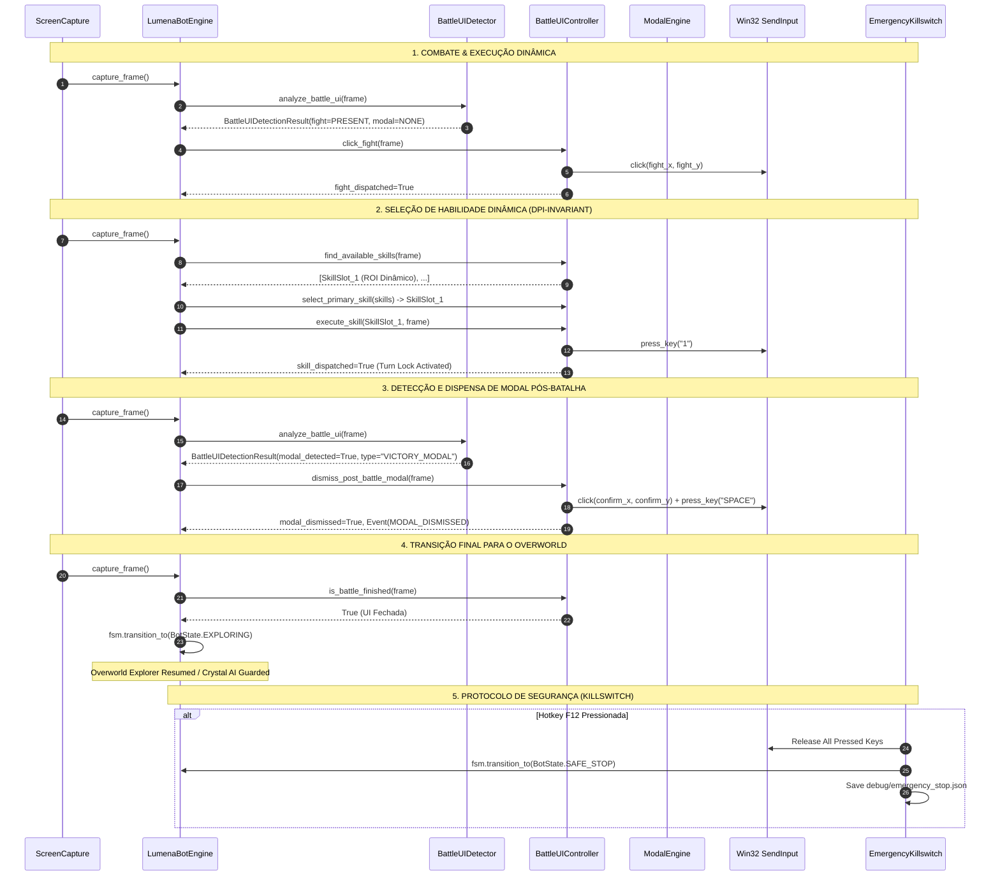

# EXECUTION TRACE — LUMENA BOT v3.9
## RASTREAMENTO DETALHADO DO CICLO DE COMBATE & TRATAMENTO DE MODAIS

---

### DIAGRAMA DE SEQUÊNCIA v3.9

---

### TRACE DE EVENTOS GERADOS NA V3.9

1. `BATTLE_UI_DETECTED` $\rightarrow$ `BATTLE_UI_CONFIRMED`
2. `FIGHT_CLICK_REQUESTED` $\rightarrow$ `FIGHT_CLICK_DISPATCHED` $\rightarrow$ `FIGHT_CLICK_VERIFIED`
3. `SKILL_UI_DETECTED` $\rightarrow$ `SKILL_SELECTED` $\rightarrow$ `SKILL_ACTION_REQUESTED` $\rightarrow$ `SKILL_ACTION_DISPATCHED`
4. `BATTLE_WAITING_TURN_RESOLUTION`
5. `MODAL_DETECTED` (tipo: `VICTORY_MODAL` / `REWARD_MODAL`)
6. `MODAL_DISMISSED`
7. `TURN_RESOLUTION_COMPLETED`
8. `BATTLE_EXIT_DETECTED` $\rightarrow$ `BATTLE_FINISHED` $\rightarrow$ `WORLD_RESUMED`
9. (Se aplicável) `KILLSWITCH_TRIGGERED` $\rightarrow$ `SAFE_STOP_TRIGGERED` $\rightarrow$ `EMERGENCY_STOP`
