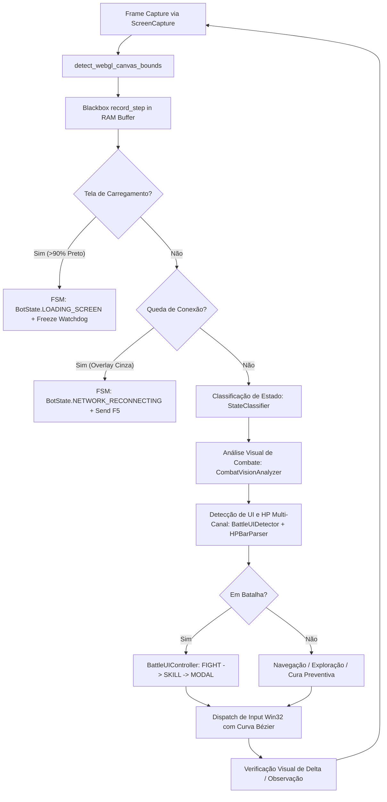

# 🔄 EXECUTION TRACE & DATA FLOW REPORT — v4.2
**Sistema**: Lumena Bot Control Center v4.2  
**Rastreabilidade**: Malha Fechada de Decisão & Percepção Resiliente  
**Data**: 17/08/2026  

---

## 1. FLUXO DE EXECUÇÃO DO CICLO DE PERCEPÇÃO E DECISÃO

---

## 2. RASTREIO DE TRANSIÇÕES DE ESTADO (FSM MATRIX)

1. **Nominal -> Loading Screen**:
   - `Trigger`: `black_pixel_ratio > 0.90`
   - `Transição`: `EXPLORING | OBSERVING | BATTLE -> BotState.LOADING_SCREEN`
   - `Ação`: Watchdog pausado, nenhum input enviado.
2. **Loading Screen -> Nominal**:
   - `Trigger`: `black_pixel_ratio < 0.80` e elementos de jogo detectados.
   - `Transição`: `BotState.LOADING_SCREEN -> BotState.EXPLORING | BotState.BATTLE`
   - `Ação`: Watchdog reiniciado, processamento nominal retomado.
3. **Queda de Conexão**:
   - `Trigger`: `_detect_network_disconnect == True` (Overlay cinza acromático uniforme).
   - `Transição`: `ANY -> BotState.NETWORK_RECONNECTING`
   - `Ação`: `F5` despachado, buffer mantido, espera de 1.0s para recarga do canvas WebGL.
4. **Anomalia / Safe Stop**:
   - `Trigger`: Killswitch acionado, Watchdog Stall (> 6s em combate), ou `_consecutive_errors >= 5`.
   - `Transição`: `ANY -> BotState.SAFE_STOP | BotState.EMERGENCY_STOP`
   - `Ação Forense`: `BlackboxFlightRecorder.dump_blackbox(reason)` grava 150 frames + `flight_data.json` em `debug/blackbox/<timestamp>_<reason>/`.

---

## 3. MAPEAMENTO DINÂMICO DE COORDENADAS COM LETTERBOXING

$$rx = cx + \lfloor nx \cdot cw \rfloor, \quad ry = cy + \lfloor ny \cdot ch \rfloor$$
- Janela 1920x1080 com Canvas centralizado de 1280x720:
  - $cx = 320, cy = 180, cw = 1280, ch = 720$
  - ROI FIGHT normalizada $(0.75, 0.70, 0.20, 0.15)$:
    $$rx = 320 + 0.75 \times 1280 = 1280$$
    $$ry = 180 + 0.70 \times 720 = 684$$
  - O clique é posicionado precisamente em cima do botão WebGL, independentemente do formato da janela.
