# 🔍 LUMENA BOT CONTROL CENTER v4.3 — EXECUTION TRACE
## Trace de Execução de Auto-Recuperação, Inspeção de Canvas e Protocolo de Campo

---

## 1. Trace do Protocolo de Teste de Campo (Field Trial 3-Cycle)

```mermaid
sequenceDiagram
    autonumber
    actor Supervisor as LiveSessionSupervisor
    participant Engine as LumenaBotEngine
    participant Win32 as TargetWindowManager
    participant Vision as CanvasInspector & HPParser
    participant Chrome as Google Chrome (WebGL)

    Supervisor->>Win32: attach_to_target_process("chrome.exe")
    Win32-->>Supervisor: TargetWindowInfo (HWND, PID, Bounds)
    Supervisor->>Supervisor: start_field_trial(num_cycles=3)

    rect rgb(20, 35, 20)
        Note over Supervisor,Chrome: CICLO 1: Entrada, Combate e Retorno
        Supervisor->>Engine: start_loop_step()
        Engine->>Chrome: Captura Frame de Exploração
        Supervisor->>Supervisor: record_cycle_step(1, "EXPLORATION_MOVEMENT", PASS)
        Engine->>Chrome: Despacho Clique FIGHT (Dynamic ROI)
        Supervisor->>Supervisor: record_cycle_step(1, "FIGHT_BUTTON_DISPATCH", PASS)
        Engine->>Chrome: Seleção de Habilidade Slot #2
        Supervisor->>Supervisor: record_cycle_step(1, "SKILL_SELECTION_SLOT_2", PASS)
        Engine->>Chrome: Dismiss de Modal Pós-Batalha
        Supervisor->>Supervisor: record_cycle_step(1, "POST_BATTLE_MODAL_DISMISSAL", PASS)
        Supervisor->>Supervisor: complete_current_cycle(1, PASS)
    end

    rect rgb(20, 25, 45)
        Note over Supervisor,Chrome: CICLO 2: Rotação de Skills & Cooldown Lock
        Supervisor->>Engine: Transição BATTLE (Ciclo 2)
        Engine->>Chrome: Despacho FIGHT
        Engine->>Chrome: Seleção de Habilidade Slot #3 (Rotação)
        Engine->>Chrome: Turn Lock & Modal Dismiss
        Supervisor->>Supervisor: complete_current_cycle(2, PASS)
    end

    rect rgb(45, 30, 20)
        Note over Supervisor,Chrome: CICLO 3: Decisão Pós-Combate (HP <= 40% -> Cura)
        Supervisor->>Engine: Transição BATTLE (Ciclo 3)
        Engine->>Chrome: Despacho FIGHT & Skill Slot #4
        Engine->>Vision: HPBarParser.calculate_hp_ratio() -> 35%
        Engine->>Chrome: Navegação para o Cristal de Cura
        Supervisor->>Supervisor: record_cycle_step(3, "POST_BATTLE_HEALING_ROUTE", PASS)
        Supervisor->>Supervisor: complete_current_cycle(3, PASS)
    end

    Supervisor->>Supervisor: evaluate_field_trial_completion()
    Supervisor->>Supervisor: export_field_trial_result("result.json")
    Note over Supervisor: Status: PHYSICALLY_VALIDATED (Live) / PASS_SYNTHETIC (Dry-Run)
```



---

## 2. Trace do Self-Healing Runtime Daemon

### Cenário A: Perda de Foco Crítica durante Ação de Combate
1. `InputController` prepara envio de clique em `[FIGHT]`.
2. `SelfHealingEngine.recover_lost_foreground(target_hwnd)` verifica `GetForegroundWindow()`.
3. Detectado: `fg_hwnd != target_hwnd` (ex: usuário clicou em outra janela).
4. `SelfHealingEngine` bloqueia o clique e emite `WINDOW_FOCUS_REQUESTED`.
5. `TargetWindowManager.ensure_foreground(target_hwnd)` executa `AttachThreadInput` e `SetForegroundWindow`.
6. Aguarda 100ms e confirma `WINDOW_FOCUS_VERIFIED`.
7. `ScreenCapture` reavalia o frame antes de prosseguir com o despacho.

### Cenário B: Janela Minimizada
1. `user32.IsIconic(hwnd) == True`.
2. `SelfHealingEngine.recover_minimized_window(hwnd)` despacha `ShowWindow(hwnd, SW_RESTORE)`.
3. Aguarda 200ms para renderização do SO.
4. Emite `EventType.WINDOW_RESTORED`.
5. `ScreenCapture.detect_webgl_canvas_bounds()` recalibra imediatamente as ROIs do Canvas.

### Cenário C: Congelamento WebGL de Quadros (Frame Freeze)
1. `SelfHealingEngine.detect_and_recover_webgl_freeze(frame)` calcula variância temporal.
2. 10 amostras consecutivas apresentam $\Delta \text{var} < 0.0005$.
3. Emite `EventType.WEBGL_FRAME_FREEZE_DETECTED`.
4. Despacha micro-movimento do mouse sobre o centro do canvas WebGL para acionar renderização no Chrome.

---

## 3. Estrutura do Payload de Saída (`result.json`)

```json
{
  "version": "v4.3",
  "timestamp": "2026-08-17 09:05:00",
  "status": "PASS_SYNTHETIC",
  "validation_category": "AUTOMATED_TESTED",
  "target_process": {
    "attached": false,
    "process_name": null,
    "pid": null,
    "hwnd": null,
    "canvas_detected": false
  },
  "metrics": {
    "fps": 30.0,
    "fps_target": 30.0,
    "fps_healthy": true,
    "average_latency_ms": 12.4
  },
  "field_trial": {
    "target_cycles": 3,
    "completed_cycles": 3,
    "total_records": 3,
    "cycles": [
      {
        "cycle_index": 1,
        "success": true,
        "reason": "Ciclo concluído com sucesso físico",
        "steps": [
          {"phase": "EXPLORATION_MOVEMENT", "success": true, "visual_delta": 0.02},
          {"phase": "FIGHT_BUTTON_DISPATCH", "success": true, "visual_delta": 0.04},
          {"phase": "SKILL_SELECTION_SLOT_2", "success": true, "visual_delta": 0.035},
          {"phase": "POST_BATTLE_MODAL_DISMISSAL", "success": true, "visual_delta": 0.03}
        ]
      }
    ],
    "trial_error": null
  }
}
```
