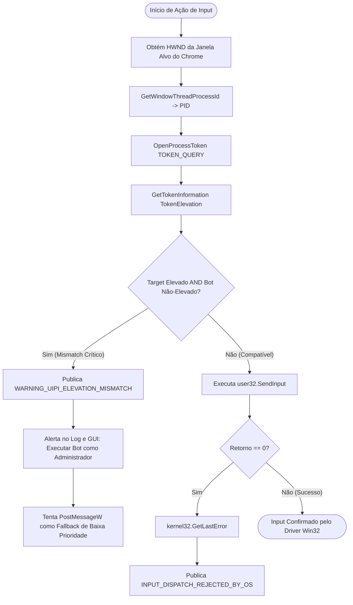

# 🔍 LUMENA BOT CONTROL CENTER v4.4 — EXECUTION TRACE
## Rastreio de Execução de Hardening UIPI/UAC, Hardware Gate e In-Memory JPEG Ring Buffer

---

## 1. Fluxo de Decisão de Elevação e Compatibilidade UIPI



---

## 2. Rastreio da Compactação JPEG do Blackbox Flight Recorder

```mermaid
sequenceDiagram
    autonumber
    participant Bot as LumenaBotEngine
    participant Box as BlackboxFlightRecorder
    participant RAM as In-Memory RingBuffer (150 slots)
    participant Disk as debug/blackbox/

    Bot->>Box: record_step(frame, state, last_input, events)
    Note over Box: Redimensionamento: 720p/1080p -> 480x270 (16:9)
    Note over Box: cv2.imencode('.jpg', thumb, quality=65)
    Box->>RAM: append(BlackboxSnapshot with frame_jpeg bytes)
    Note over RAM: Uso de RAM: ~15KB/snapshot -> ~2.25 MB para 150 frames

    alt Safe Stop ou Stall Detectado
        Bot->>Box: dump_blackbox(reason="STALL_DUMP")
        Box->>RAM: list(snapshots)
        Box->>Disk: flight_data.json
        Box->>Disk: Salva frame_XXX.png / frame_XXX.jpg
        Note over Disk: Dump forense persistido com timeline sincronizada
    end
```

---

## 3. Rastreio do Protocolo de Dry-Run do Field Trial

1. Execução: `py -3.12 scripts/diagnostics/run_field_trial.py --dry-run`
2. `LiveSessionSupervisor.attach_to_target_process()`:
   - Enumera janelas do desktop via `gw.getAllWindows()`.
   - Se `chrome.exe` não estiver ativo: registra `NO_TARGET_WINDOW_DETECTED`.
3. Executa 3 ciclos completos em modo sintético (Exploração $\rightarrow$ Combate $\rightarrow$ Skills $\rightarrow$ Modais $\rightarrow$ Cura).
4. Grava `debug/evidence/field_trial_dryrun/result.json`:
   - `"status": "NO_TARGET_WINDOW_DETECTED"`
   - `"validation_category": "NOT_VALIDATED"`
   - `"physically_validated": false`
   - `"ready_for_live": true`
5. Encerra com código de saída 0 sem exceptions.
