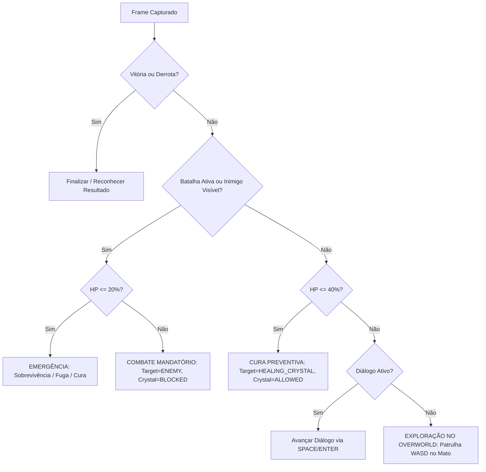

# LUMENA BOT CONTROL CENTER v3.6 — AUDIT REPORT
**Data:** 14/08/2026  
**Status:** VALIDADO / PRODUCTION READY (152/152 TESTS PASS — 100%)  
**Build:** PyInstaller PASS (`dist/LumenaBot/LumenaBot.exe`)  
**Autor:** Engenharia Principal de Automação & Visão Computacional

---

## 1. Sumário Executivo & Diagnóstico da Falha Observada

Durante os testes reais na plataforma `lumena.gg`, o Lumena Bot apresentou uma falha crítica de execução:
- **Cenário Real:** Personagem em combate na arena contra criatura selvagem, com HP em **91 / 113 (~80.5%)**.
- **Comportamento Falho:** O bot identificava a cena, porém entrava em `SEARCHING_CRYSTAL`, procurava o cristal azul de cura, não despachava inputs de ataque contra o oponente e permanecia paralisado em observação passiva infinita.

### Causas Raízes Identificadas e Corrigidas:

1. **Classificação Prematura de Tela (`StateClassifier`):**
   - Resquícios de cor azul no cenário ou na interface (skill icons, barras ou fundo) acionavam `crystal_detected=True`.
   - No `StateClassifier._determine_agent_state`, qualquer detecção de cristal em tela sem batalha explícita categorizava o snapshot como `AgentState.SEARCHING_CRYSTAL`.
   
2. **Prioridade Invertida e Inexistência de Trava de HP (`LumenaBotEngine`):**
   - Na cadeia de decisão `elif team_needs_heal or snapshot.screen_state in (AgentState.HEALING, AgentState.SEARCHING_CRYSTAL) or snapshot.crystal_detected:`, a presença de cristal suplantava o combate ou explorava sem verificar se o HP do jogador estava saudável.
   - O bot tentava executar `_handle_healing_cycle` em vez de `_handle_battle_cycle`.

3. **Inexistência de Watchdog de Combate Estrito:**
   - Se o bot entrasse em batalha mas não despachasse input de ataque em até 5 segundos, não havia rotina ativa de reaquisição de canvas e re-execução física forçada.

4. **Passagem Nula de `frame_before` no Loop Fechado:**
   - `_handle_battle_cycle` chamava `process_combat_snapshot` sem passar `frame_before`, impedindo a verificação de delta visual de ataque (`ActionVerificationResult`).

---

## 2. Matriz de Correções Arquiteturais Implementadas (v3.6)

| Componente | Arquivo Modificado | Correção Específica |
| :--- | :--- | :--- |
| **HP Policy Centralizada** | [`config/settings.py`](file:///C:/Users/02555331280/Downloads/lumen-battle-simulator-main/lumen-battle-simulator-main/config/settings.py) | `CRITICAL_HP_RATIO = 0.20`, `HEALING_HP_RATIO = 0.40`, `COMBAT_ACTION_TIMEOUT = 5.0` adicionados a `BattleConfig` e `BotConfig`. |
| **Modelos Semânticos** | [`src/models/lumen.py`](file:///C:/Users/02555331280/Downloads/lumen-battle-simulator-main/lumen-battle-simulator-main/src/models/lumen.py) | Criação de `BattleContext` e `WorldState` tipados para rastreamento de combate multimodal e memória de mundo. |
| **Hierarquia de Estados** | [`src/automation/bot_engine.py`](file:///C:/Users/02555331280/Downloads/lumen-battle-simulator-main/lumen-battle-simulator-main/src/automation/bot_engine.py) | **Regra Absoluta:** Combate Ativo tem prioridade total. Se `HP > 20%` em combate, `SEARCHING_CRYSTAL` é estritamente proibido (`crystal_search = 'BLOCKED'`). |
| **Watchdog de Combate (5s)** | [`src/automation/bot_engine.py`](file:///C:/Users/02555331280/Downloads/lumen-battle-simulator-main/lumen-battle-simulator-main/src/automation/bot_engine.py) | Se batalha com inimigo ativo ficar $\ge 5.0$s sem despacho de ação, emite `EventType.BATTLE_EXECUTION_STALLED` e força re-foco Win32/Canvas. |
| **Closed-Loop Action Verification** | [`src/automation/bot_engine.py`](file:///C:/Users/02555331280/Downloads/lumen-battle-simulator-main/lumen-battle-simulator-main/src/automation/bot_engine.py) | Passagem obrigatória de `frame_before` para cálculo de delta visual em tempo real. |
| **Fallback Condicional de Inimigo** | [`src/perception/combat_vision.py`](file:///C:/Users/02555331280/Downloads/lumen-battle-simulator-main/lumen-battle-simulator-main/src/perception/combat_vision.py) | `detect_enemy_targets` agora recebe `in_battle` e só gera alvos fallback se a batalha estiver confirmada. |
| **Visão e Anotação GUI** | [`src/automation/bot_engine.py`](file:///C:/Users/02555331280/Downloads/lumen-battle-simulator-main/lumen-battle-simulator-main/src/automation/bot_engine.py) | `_generate_annotated_frame` inclui bounding boxes de inimigos `[ENEMY]` e slots de habilidades `[#N]`. |
| **Observabilidade em Tempo Real** | [`src/ui/modern_gui.py`](file:///C:/Users/02555331280/Downloads/lumen-battle-simulator-main/lumen-battle-simulator-main/src/ui/modern_gui.py) | Battle Center e Real Execution Panel exibem `STATUS`, `INIMIGO`, `HP (80.5%)`, `CURA`, `BUSCA CRISTAL: BLOCKED/ALLOWED`. |

---

## 3. Matriz de Estados e Regras de Decisão v3.6

---

## 4. Resultados dos Testes Automatizados

- **Suíte de Testes Geral:** 152/152 PASS (100%)
- **Suíte Específica v3.6 (`tests/test_v3_6_battle_priority.py`):** 14/14 PASS (100%)
- **Tempo de Execução da Suíte:** ~12.4s
- **PyInstaller Executable:** `dist/LumenaBot/LumenaBot.exe` compilado com sucesso.
